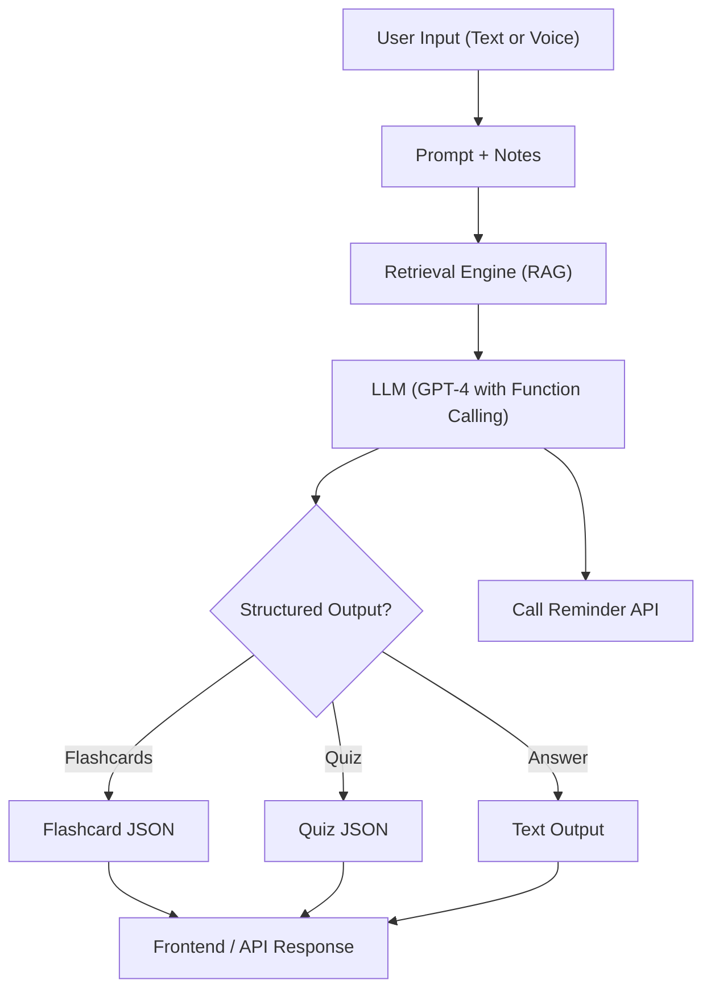

# 🧠 Smart Study Assistant — AI Tutor with Zero-Shot Prompting, RAG & Function Calling

A personalized AI-powered tutor that intelligently adapts to any question using **Zero-Shot Prompting**, **Retrieval-Augmented Generation (RAG)**, and **Function Calling**. This assistant helps students **study smarter** by automatically optimizing AI responses for different subjects and learning contexts.

> ✨ Built for BTech prep, competitive exams, and lifelong learners with intelligent prompt adaptation.

---

## 🚀 Features

| Feature                       | Description                                                                 |
|------------------------------|-----------------------------------------------------------------------------|
| 🎯 **Zero-Shot Prompting**        | Automatically detects question type (math, science, history, etc.) and optimizes AI responses accordingly. |
| 🔍 **Question Answering (RAG)**     | Ask questions from uploaded notes or PDFs. Get AI-generated answers grounded in source content. |
| 🧾 **Summarization**              | Upload documents and get key-point summaries for revision.                |
| 🎓 **Flashcard Generator**        | Auto-generate Q&A flashcards for active recall and spaced repetition.     |
| 📋 **Quiz Generator (MCQs)**      | Convert study material into quizzes with correct options and distractors. |
| ⏰ **Reminder Scheduler**         | Schedule study sessions or revision reminders using natural language.     |
| 🧠 **Adaptive Prompting**         | Subject-specific prompts with difficulty levels (beginner/intermediate/advanced). |

---

## 🧠 Tech Stack

| Layer                | Tools Used |
|---------------------|------------|
| ⚙️ Backend           | Node.js, Express.js, JavaScript (ES Modules) |
| 📄 Document Parsing | JavaScript parsing utilities |
| 🧠 Language Model    | Google Gemini API (@google/genai) |
| 🔍 Vector DB         | In-memory context management |
| 🎯 Structured Output | JSON schemas for flashcards, summaries, quizzes |
| 🧠 Function Calling  | Reminder APIs, quiz generation, schedule builder |
| 🌐 Frontend (optional) | React.js + Tailwind CSS or Postman/Bruno for API demo |
| 🔧 Prompting Strategies | Zero-Shot, One-Shot, Multi-Shot, Chain-of-Thought |

---

## 🏗️ Architecture



---

## ✨ Sample Use Cases

> 🗂️ Upload syllabus or PDF notes, then try:

### 🔹 Question Answering
```txt
"Explain Newton's Second Law with examples from my uploaded physics notes."
```

### 🔹 Flashcard Generation
```txt
"Generate 5 flashcards for the photosynthesis topic in my biology.pdf."
```

### 🔹 Quiz Generation
```txt
"Create a quiz with 5 MCQs from the chapter on Semiconductor Devices."
```

### 🔹 Zero-Shot Prompting (NEW!)
```txt
# Automatic subject detection and optimization
"Solve 2x + 5 = 15"  # → Detects math, shows step-by-step solution
"What is photosynthesis?"  # → Detects science, provides detailed explanation with examples
"When did World War I start?"  # → Detects history, gives chronological context

# Manual control with options
node zero-shot.js --type math --level beginner "Explain derivatives"
node zero-shot.js --task tutorial "How to solve quadratic equations"
```

### 🔹 Reminder Scheduling (Function Calling)
```txt
"Remind me to revise Operating Systems every Monday at 7 PM."
```

---

## ⚙️ How It Works (Behind the Scenes)

1. **Upload Document / Notes**  
   PDF, Markdown, or plain text is parsed and chunked for embedding.

2. **Vector Store Creation**  
   Notes are embedded and stored in a vector DB (e.g., Chroma).

3. **RAG Pipeline**  
   On user query, relevant chunks are retrieved and passed into the LLM.

4. **Prompting + Role Instructions**  
   Prompts are engineered to elicit tutor-like answers, summaries, or flashcards.

5. **Structured Output**  
   JSON schema (with tool calling or OpenAI function calling) enables:
   - Reminders (via API)
   - Flashcard/Quiz output
   - Visual rendering on frontend

---

## 🛠️ Setup Instructions

### 1. Clone the repo
```bash
git clone https://github.com/kalviumcommunity/Smart-Study-Assistant.git
cd smart-study-assistant
```

### 2. Install dependencies
```bash
npm install
# or if using Python-based document processing
pip install -r requirements.txt
```

### 3. Set up environment variables

Create `.env` and add:
```

```

### 4. Run backend server
```bash
npm run dev
```

### 5. Upload PDFs & Test
Use Postman or frontend UI to upload a file and ask questions.

---

## 🧪 API Examples

### POST `/ask-question`
```json
{
  "query": "What is Ohm's Law?",
  "documentId": "physics-notes"
}
```

### POST `/generate-flashcards`
```json
{
  "topic": "Photosynthesis",
  "documentId": "bio.pdf"
}
```

### POST `/schedule-reminder`
```json
{
  "reminder": "Revise DSA on weekends",
  "time": "Saturday 6 PM"
}
```

---

## 🚀 Quick Start - Zero-Shot Prompting

### Command Line Usage
```bash
# Navigate to backend directory
cd backend

# Basic usage (automatic detection)
node zero-shot.js "What is photosynthesis?"
node zero-shot.js "Solve 3x + 7 = 22"

# With specific options
node zero-shot.js --type math --level beginner "Explain calculus"
node zero-shot.js --task tutorial "How to write Python functions"

# See all available options
node zero-shot.js --types
node zero-shot.js --help

# Run demonstration
node demo-zero-shot.js
```

### API Usage
```bash
# Standard chat with zero-shot prompting
curl -X POST http://localhost:3000/chat \
  -H "Content-Type: application/json" \
  -d '{"message": "Solve 2x + 5 = 15", "options": {"promptType": "math"}}'

# Advanced zero-shot endpoint
curl -X POST http://localhost:3000/chat/zero-shot \
  -H "Content-Type: application/json" \
  -d '{"message": "Explain machine learning", "promptType": "programming", "level": "intermediate"}'

# Get available prompt types
curl http://localhost:3000/chat/types
```

---

## 🧰 Prompt Engineering Examples

> System Prompt:
```
You are a friendly and helpful tutor for engineering students. You answer using the uploaded study notes only. Keep explanations concise and exam-focused.
```

> User Prompt:
```
Based on my Operating Systems notes, explain multithreading with examples.
```

> Output Format (Structured):
```json
{
  "topic": "Multithreading",
  "explanation": "Multithreading allows multiple threads to run concurrently...",
  "examples": ["Thread A for UI", "Thread B for I/O operations"]
}
```

---

## 🧠 RAG Setup

- Load document using LangChain / LlamaIndex
- Split into chunks (~500 tokens)
- Embed using OpenAI Embeddings
- Store in FAISS/Chroma vector store
- Query = Embed + Similarity search + Prompt injection

---

## 💡 Future Features

- 🗣️ Voice Interaction via Whisper + TTS
- 📚 Notion/Obsidian integration
- 📱 Mobile version in React Native
- 📊 Analytics Dashboard for user performance
- 🎮 Gamification with rewards & leaderboards

---

## 👨‍💻 Author

> **Chethan Regala**  
Second year BTech Student(Kalvium) | Passionate about Generative AI, Full Stack, and Building Scalable Products  
📧 chethanregala123@gmail.com  
🔗 [LinkedIn](https://www.linkedin.com/in/chethan-regala-9b671a34a/) | [GitHub](https://github.com/chethan-gen)

---